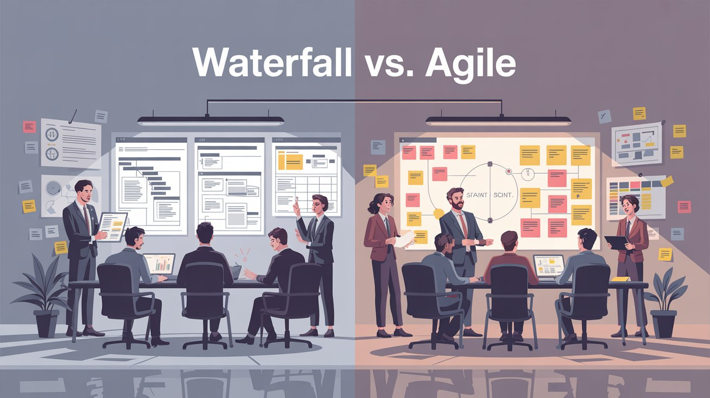

# Waterfall vs. Ágil: Qual Metodologia Escolher para seu Projeto?

## Informações

- **Tags:** Metodologia de projeto, Waterfall, Ágil, Gestão de projetos
- **Data de Publicação:** 03/07/2025  

## Artigo

No desenvolvimento de software, escolher a metodologia de gerenciamento de projetos adequada pode ser a diferença entre o sucesso e o fracasso de um projeto. Duas das abordagens mais populares são Waterfall e Ágil, cada uma com suas vantagens e desvantagens, dependendo do contexto do projeto. Neste artigo, exploraremos as principais características de ambas as metodologias, discutindo seus prós e contras, e fornecendo orientações sobre como escolher a melhor para o seu projeto.

### O que é o Modelo Waterfall?

O modelo Waterfall, ou cascata, é uma metodologia tradicional e sequencial, onde cada fase do ciclo de vida do projeto deve ser concluída antes que a próxima comece. As etapas típicas do Waterfall incluem:

1. **Levantamento de Requisitos**: Nesta fase inicial, todos os requisitos do software são coletados e documentados de maneira clara.

2. **Design**: A arquitetura e o design do sistema são criados, definindo como os requisitos serão implementados.

3. **Implementação**: O código é escrito com base no design definido na fase anterior.

4. **Testes**: O sistema é testado para garantir que os requisitos foram atendidos e que não há erros.

5. **Implantação**: O software é entregue ao cliente e entra em operação.

6. **Manutenção**: Ajustes e correções são feitos conforme necessário após a implantação.

#### Vantagens do Waterfall

- **Clareza e Estrutura**: O Waterfall segue um fluxo claro e estruturado, o que facilita o planejamento detalhado.

- **Documentação Completa**: Como cada fase é cuidadosamente documentada, essa metodologia oferece um ótimo suporte para a manutenção e para novos desenvolvedores se integrarem ao projeto.

- **Controle e Supervisão**: A natureza sequencial do Waterfall facilita a supervisão de cada etapa, com marcos claros a serem alcançados antes de seguir adiante.

#### Desvantagens do Waterfall

- **Inflexível a Mudanças**: Uma vez que uma fase é concluída, voltar atrás para fazer alterações pode ser difícil e caro.

- **Longo Tempo de Entrega**: Como todas as fases precisam ser concluídas antes da implantação, o tempo entre o início do projeto e a entrega de algo utilizável pode ser longo.

- **Risco Elevado**: Se houver um erro em fases iniciais, isso pode não ser identificado até a fase de testes, resultando em grandes retrabalhos.

### O que é a Metodologia Ágil?

A metodologia **Ágil** é baseada em ciclos iterativos e incrementais de desenvolvimento. Em vez de seguir uma sequência rígida, o Ágil foca em entregas contínuas e rápidas de pequenas partes funcionais do software, permitindo ajustes frequentes e feedback constante dos clientes. As principais fases do Ágil incluem:

1. **Planejamento de Iterações**: Cada ciclo começa com o planejamento das funcionalidades a serem desenvolvidas.

2. **Desenvolvimento**: As funcionalidades são codificadas e integradas ao sistema.

3. **Testes e Feedback**: A equipe realiza testes contínuos e coleta feedback do cliente em cada iteração.

4. **Entrega Contínua**: Funcionalidades são entregues ao cliente em incrementos constantes, oferecendo valor em prazos mais curtos.

#### Vantagens do Ágil

- **Flexibilidade**: A principal força do Ágil é sua capacidade de adaptação. Mudanças nos requisitos são bem-vindas e facilmente incorporadas ao projeto.

- **Entrega Rápida**: Com entregas frequentes, os clientes recebem funcionalidades utilizáveis rapidamente, o que permite ajustes e melhorias contínuas.

- **Envolvimento do Cliente**: O feedback constante do cliente em cada iteração garante que o produto final atenda às suas expectativas.

#### Desvantagens do Ágil

- **Falta de Documentação Detalhada**: A ênfase em entregas rápidas pode resultar em documentação insuficiente, dificultando a manutenção futura.

- **Falta de Controle Total**: Para projetos grandes, a natureza iterativa pode dificultar o controle completo sobre o progresso, uma vez que as prioridades podem mudar rapidamente.

- **Necessidade de Colaboração Contínua**: A equipe precisa estar em constante comunicação com o cliente, o que pode ser um desafio em contextos com pouca disponibilidade.

### Comparando Waterfall e Ágil

#### Estrutura

- **Waterfall**: Rígida e sequencial, com fases bem definidas que precisam ser concluídas antes de avançar.

- **Ágil**: Flexível e iterativa, permitindo mudanças e ajustes em ciclos curtos de desenvolvimento.

#### Entrega de Produto

- **Waterfall**: O produto completo é entregue apenas ao final de todas as fases.

- **Ágil**: Funcionalidades são entregues em incrementos frequentes, fornecendo valor contínuo ao cliente.

#### Adaptação a Mudanças

- **Waterfall**: Difícil e cara, pois as fases precisam ser concluídas em sequência.

- **Ágil**: Mudanças são bem-vindas e facilmente integradas ao processo a qualquer momento.

#### Documentação

- **Waterfall**: Requer uma documentação completa e detalhada em todas as etapas.

- **Ágil**: A documentação pode ser limitada, com foco maior nas entregas rápidas e interação com o cliente.

#### Feedback do Cliente

- **Waterfall**: O feedback é geralmente recebido apenas após a conclusão do projeto.

- **Ágil**: O cliente fornece feedback constante em todas as fases, permitindo ajustes frequentes.

#### Utilizações

- **Waterfall**: Projetos bem definidos e estáveis, onde as exigências são claras desde o início e há necessidade de controle rigoroso.

- **Ágil**: Projetos dinâmicos, com mudanças constantes nos requisitos e necessidade de entregas rápidas e colaborativas.

### Qual Metodologia Escolher?

#### Quando Escolher Waterfall?

O Waterfall é ideal para projetos onde:

- **Os requisitos são bem definidos desde o início** e há pouca chance de mudanças significativas ao longo do caminho.

- **Há necessidade de uma documentação detalhada**, seja para fins regulatórios ou para manutenção futura.

- **O controle rigoroso de cada fase** é essencial, como em projetos governamentais ou industriais.

#### Quando Escolher Ágil?

O Ágil é mais adequado para projetos onde:

- **Os requisitos são voláteis** ou não completamente definidos no início, exigindo flexibilidade para ajustar o software às novas necessidades.

- **A entrega rápida de partes do produto** é crítica, como em startups ou empresas que precisam de um retorno rápido do mercado.

- **A colaboração com o cliente é constante**, garantindo que o produto evolua de acordo com as expectativas e feedbacks contínuos.

### Conclusão

A escolha entre Waterfall e Ágil depende, em grande parte, das características e demandas do seu projeto. O Waterfall é mais indicado para ambientes estáveis, onde as exigências são claras e imutáveis. Já o Ágil é perfeito para projetos dinâmicos e complexos, onde a flexibilidade e a entrega rápida de valor são fundamentais. Avaliar as necessidades do cliente, os prazos, os recursos disponíveis e o grau de incerteza nos requisitos ajudará a determinar qual metodologia é mais adequada para o seu cenário.

Independentemente da escolha, o sucesso do projeto está diretamente ligado à capacidade da equipe em adaptar-se e utilizar a metodologia escolhida de maneira eficiente.