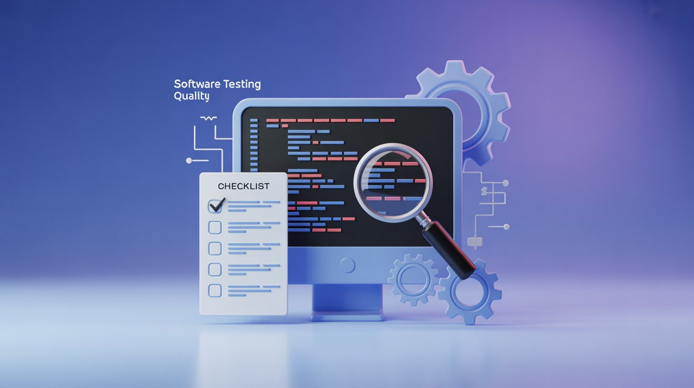

# Teste de Software e Qualidade: Como o Checklist CARTER Ajuda a Garantir Projetos Mais Confiáveis

## Informações

- **Tags:** Teste de Software, Qualidade de Software
- **Data de Publicação:** 03/10/2025  

## Artigo

Em um mundo onde os sistemas estão cada vez mais complexos e interconectados, **garantir a qualidade do software** deixou de ser um luxo — é uma necessidade.
E engana-se quem pensa que testar é apenas “rodar casos de teste” ou clicar em botões esperando encontrar um erro. O teste é um processo **estratégico e contínuo**, que começa muito antes da aplicação estar pronta.

Neste artigo, você vai entender:

- [O que é **teste de software** (e o que ele **não é**)](#o-que-é-teste-de-software-e-o-que-ele-não-é)
- [Como o teste se relaciona com a **qualidade** do produto](#como-o-teste-se-relaciona-com-a-qualidade-do-produto)
- [Por que a **verificação estática** é essencial para evitar falhas](#por-que-a-verificação-estática-é-essencial-para-evitar-falhas)
- [Como aplicar o **checklist CARTER** para revisar requisitos e prevenir erros desde o início do projeto](#como-aplicar-o-checklist-carter-para-revisar-requisitos-e-prevenir-erros-desde-o-início-do-projeto)

### O que é teste de software (e o que ele não é)

Quando falamos em teste, muitas pessoas pensam logo em executar scripts ou usar ferramentas de automação.
Mas a verdade é que **testar vai muito além da execução** — envolve **verificar**, **analisar** e **validar** se tudo que foi planejado realmente faz sentido e atende às expectativas.

O teste é composto por **duas grandes etapas**:

#### Verificação (Abordagem Estática)

Essa é a fase **preventiva** do teste. Aqui, **antes mesmo do código existir**, analisamos documentos como requisitos, especificações e modelagens.
O objetivo é garantir que **os artefatos do projeto estejam coerentes e completos**.

#### Validação (Abordagem Dinâmica)

Essa é a fase **prática**, onde o produto já está tomando forma.
Aqui, testamos **na prática** se o sistema faz o que foi planejado, executando casos de teste, verificando comportamentos e encontrando defeitos.

As duas fases se complementam:

- **Verificação** garante que estamos **construindo o produto certo**;
- **Validação** garante que **o produto funciona corretamente**.

#### Por que Testar é Essencial

Testar é, acima de tudo, **lidar com a realidade de que erros acontecem**.
Pessoas se distraem, interpretam de formas diferentes e, às vezes, até um dia ruim pode levar a um descuido.

> "Penso, logo erro." — René Descartes (com uma pitada de ironia)

> "Em Deus nós confiamos. Todo o resto, nós testamos." — W. Edwards Deming (também com ironia)

Todo sistema contém bugs — a diferença está em **quando e como você os descobre**.
Quanto antes um problema é detectado, **mais barato** e **menos impactante** é corrigi-lo.

Testar é um investimento em **confiabilidade** e **segurança**.

### Como o teste se relaciona com a qualidade do produto

A qualidade de um software não está apenas em “não ter bugs”.
Ela está em **atender às necessidades do usuário** — tanto as **explícitas** (o que foi pedido) quanto as **implícitas** (o que é esperado, mesmo sem ter sido dito).

Por exemplo: Uma feijoada completa pode parecer incrível para uma pessoa, mas para outra, pode ser a pior escolha possível.

No desenvolvimento de software, qualidade é **suprir essas necessidades de forma consistente**.
E o **teste** é uma das principais formas de contribuir para isso:

- Encontra e ajuda a corrigir defeitos antes que cheguem ao usuário;
- Reduz riscos e aumenta a confiança no produto;
- Fornece feedback valioso sobre a saúde do sistema.

Mas é importante lembrar:

> O teste **não cria qualidade** — ele **revela** e **melhora** a qualidade existente.

### Por que a verificação estática é essencial para evitar falhas

Corrigir um erro **depois** que ele chega ao código (ou pior, ao usuário) é **caro** e **demorado**.

Por isso, o foco deve ser **prevenir** falhas.
É aqui que entra a **abordagem estática**, também chamada de verificação.

Ela atua nas fases iniciais do projeto, analisando requisitos, documentos e especificações.
Assim, é possível identificar **ambiguidade**, **falta de clareza** ou **inconsistências** antes que elas se tornem bugs reais.

Existe até um conceito famoso:

> A **Regra 10 de Myers**  diz que o custo de um erro multiplica por 10 a cada fase do ciclo de vida do software.

Ou seja:

- Descobrir um erro no requisito pode custar **$1**;
- No desenvolvimento, **$10**;
- Em produção, **$100** (ou mais!).

Por isso, **analisar** e **revisar requisitos** com cuidado é um passo essencial para garantir qualidade.

### Como aplicar o checklist CARTER para revisar requisitos e prevenir erros desde o início do projeto

Uma das formas mais eficazes de aplicar a verificação estática é usar um **checklist estruturado**.

O **CARTER** é um dos modelos mais conhecidos para revisar **requisitos de software**.
Ele ajuda a identificar falhas, lacunas e riscos logo no início.

Veja o que significa cada letra:

#### C - Completude

Verifica se o requisito está **completo**, com todas as informações necessárias e dentro dos padrões da empresa (como rastreabilidade e identificadores únicos).

Alguns testes para essa etapa:

- Especificação está **completa**?
- Especificação está **identificada**?
- Especificação está **compreensível**?

##### Exemplo

> “Restringir a disponibilidade de aceitação de propostas de cartões enquadrados quando o limite de crédito
parcelado superar o total de transações pendentes com valor excedente das parcelas faltantes cuja soma
ultrapasse os créditos já contabilizados na fatura anterior.”

Reprovado: 

- Requisito não compreensível na primeira leitura.

#### A - Ambiguidade

Procura **inconsistências**, **imprecisões** ou **termos vagos**.

Alguns testes para essa etapa:

- A terminologia do requisito é **consistente**?
- Existe compreensibilidade e clareza no requisito?
- Há maneira de entendê-lo de forma errada?

##### Exemplo

> “Desenvolver relatório mensal contendo o volume de páginas de todos os tipos de cartas geradas pelo sistema GX, segregados por emissor"

Reprovado:

- Utiliza palavras vagas como "todos os tipos" e "segregados por emissor".
- A sigla "GX" não é explicada.

#### R - Relevância

Avalia se o requisito é **realmente necessário** e traz **valor** ao produto.

Alguns testes para essa etapa:

- O que aconteceria se alguns requisitos não 
fossem implementados?
- Os requisitos são soluções "disfarçadas" de 
requisitos?
- Tem como identificar o requisito que entrou na 
Especificação após sua implementação?

##### Exemplo

> “Incluir campo de aprovação de propostas para produtos Private Label na tela “APIA”, verificando se o mesmo é alfa-numérico, consistindo se já existe uma proposta pendente e consultando informações do SERASA pelo número do CPF."

Reprovado:

- Requisito disfarçado de solução.

#### T - Testabilidade

Verifica se o requisito **pode ser testado**.
Há informações suficientes para que a equipe de QA crie casos de teste?

Alguns testes para essa etapa:

- Existe pelo menos um critério de aceite mensurável 
para cada requisito dentro da Especificação?
- Os requisitos de teste estão identificados quanto aos responsáveis pela sua execução?

##### Exemplo

> “Cobrança de Tarifa pela re-emissão do cartão”

Critério de aceite:

- “O Sistema Legado deverá recepcionar o serviço Siebel e providenciar a re-emissão do cartão com o custo de tarifa informado”

Reprovado:

- Não existe critério de aceite, pois o critério acima é um novo requisito.

#### R - Realizabilidade

Analisa se o requisito é **viável tecnicamente**, considerando o tempo, recursos e contexto do projeto.

Alguns testes para essa etapa:

- O número de pessoas, prazo e esforços permitem que o requisito seja implementado sem impactar o cronograma?

##### Exemplo

> “Incluir novo modelo de dígito verificador para todos os cartões Private Label”

Reprovado:

- Você possui o skill, o tempo, os recursos necessários para testar e implementar esta demanda conforme cronograma já definido para o projeto?

#### Exemplo Prático: Tabela CARTER

A seguir, um modelo que você pode adaptar para revisar seus próprios requisitos:

| Requisito                                         | Completude | Ambiguidade | Realizabilidade | Testabilidade | Relevância | Resultado | Justificativa                                           |
|---------------------------------------------------|-------------|--------------|------------------|----------------|-------------|------------|---------------------------------------------------|
| RF001 - O sistema deve permitir login com e-mail e senha. | ✅          | ✅           | ✅               | ✅             | ✅          | Aprovado | Requisito claro, completo, viável e fácil de testar.|

##### Legenda dos símbolos
- ✅ = Atende ao critério
- ⚠️ = Parcialmente atendido / precisa revisão
- ❌ = Não atende

### Conclusão

O **teste de software** é muito mais do que encontrar bugs — é **garantir que o produto final realmente atenda às expectativas**.
E a **qualidade** não é alcançada por acaso: ela é construída, passo a passo, desde os primeiros documentos do projeto.

Usar ferramentas como o **checklist CARTER** é uma forma simples e poderosa de **prevenir falhas**, economizar tempo e garantir que o software entregue tenha **confiabilidade**, **clareza** e **valor**.

> Testar é encontrar defeitos.

> Garantir qualidade é **evitá-los antes mesmo que aconteçam.**
