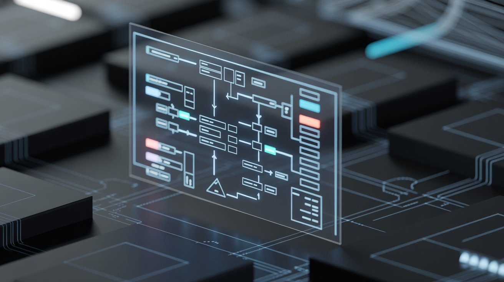

# UML explicada: Estrutura, comportamento e interação de sistemas

## Informações

- **Tags:** Engenharia de Software, Arquitetura de Software
- **Data de Publicação:** 18/03/2026

## Artigo

À medida que sistemas se tornam maiores, distribuídos e integrados a diversos serviços, apenas ler código já não é suficiente para compreender como tudo funciona. Antes mesmo da implementação, equipes precisam discutir estrutura, responsabilidades, fluxos e interações — e é exatamente aí que entra a **UML (Unified Modeling Language)**.

A UML é uma **linguagem visual usada para descrever sistemas de software de forma padronizada**. Em vez de depender de uma tecnologia específica, ela permite representar conceitos do sistema em um nível mais alto de abstração, facilitando entendimento, comunicação e documentação.

Ao longo deste artigo, veremos qual é o papel da UML dentro do desenvolvimento de software, como seus diagramas se organizam e de que forma cada perspectiva ajuda a descrever um sistema — desde sua estrutura até o comportamento e a comunicação entre suas partes.

### Índice

- [O que significa modelar um sistema](#o-que-significa-modelar-um-sistema)
- [Perspectiva estrutural: do que o sistema é feito](#perspectiva-estrutural-do-que-o-sistema-é-feito)
    - [Diagrama de Classes](#diagrama-de-classes)
    - [Diagrama de Objetos](#diagrama-de-objetos)
    - [Diagrama de Componentes](#diagrama-de-componentes)
    - [Diagrama de Pacotes](#diagrama-de-pacotes)
    - [Diagrama de Implantação](#diagrama-de-implantação)
    - [Diagrama de Estrutura Composta](#diagrama-de-estrutura-composta)
    - [Diagrama de Perfil](#diagrama-de-perfil)
- [Perspectiva comportamental: o que o sistema faz](#perspectiva-comportamental-o-que-o-sistema-faz)
    - [Diagrama de Casos de Uso](#diagrama-de-casos-de-uso)
    - [Diagrama de Atividades](#diagrama-de-atividades)
    - [Diagrama de Máquina de Estados](#diagrama-de-máquina-de-estados)
- [Perspectiva de interação: como as partes se comunicam](#perspectiva-de-interação-como-as-partes-se-comunicam)
    - [Diagrama de Sequência](#diagrama-de-sequência)
    - [Diagrama de Comunicação](#diagrama-de-comunicação)
    - [Diagrama de Tempo](#diagrama-de-tempo)
    - [Diagrama de Interação Geral](#diagrama-de-interação-geral)
- [Conclusão](#conclusão)
    - [Resumo rápido](#resumo-rápido)

### O que significa modelar um sistema

Modelar é **representar o software antes (ou independentemente) da implementação**.
Da mesma forma que uma planta descreve uma construção antes da obra, a modelagem descreve a **organização e o funcionamento do sistema** sem depender da linguagem de programação.

A UML não define como desenvolver software — ela não é metodologia nem framework.
Seu papel é servir como uma **linguagem comum para representar ideias**.

Entre seus principais benefícios:

- reduz ambiguidades na comunicação
- facilita entendimento entre áreas técnicas e não técnicas
- documenta decisões arquiteturais
- fornece visão geral do sistema
- independe de tecnologia

A linguagem organiza suas representações em três perspectivas complementares: **estrutura**, **comportamento** e **interação**.

### Perspectiva estrutural: do que o sistema é feito

Os diagramas estruturais mostram a **organização estática** do sistema — seus elementos e relações.

#### Diagrama de Classes

O diagrama de classes descreve a **estrutura lógica** de um sistema orientado a objetos.
Ele apresenta classes, atributos, operações e relacionamentos.

Uma classe é representada por um **retângulo dividido em até três partes**:
- a parte superior contém o nome da classe;
- a parte do meio lista os atributos (variáveis);
- a parte inferior mostra as operações (métodos).

> Nem sempre todas as partes são preenchidas. Isso dependerá do nível de detalhe necessário para a modelagem.

Uma classe pode aparecer de **três formas**: 
- apenas o nome;
- nome e atributos;
- nome, atributos e operações.

Alguns elementos possuem **notação própria**:
- `+` público;
- `-` privado;
- `#` protegido;
- sublinhado -> membro estático;
- itálico -> membro abstrato.

Seus relacionamentos principais são:
- **agregação** — relação todo-parte independente -> representada por um losango vazio
- **composição** — relação todo-parte dependente -> representada por um losango preenchido
- **generalização** — relação de herança -> representada por uma seta com ponta triangular
- **dependência** — relação de uso -> representada por uma seta tracejada
- **associação** — relação de uso mais forte -> representada por uma linha sólida
- **realização** — relação entre interface e implementação -> representada por uma seta tracejada com ponta triangular

#### Diagrama de Objetos

Se o Diagrama de Classes mostra a estrutura geral (modelo),
o Diagrama de Objetos mostra **instâncias concretas** dessa estrutura.

É utilizado para representar:
- objetos (instâncias de classes);
- seus valores de atributos;
- suas relações.

> Não mostra métodos porque o foco é na estrutura de dados, não no comportamento.

#### Diagrama de Componentes

Mostra o sistema como um **conjunto de módulos conectados por interfaces**.

É utilizado para representar:
- serviços;
- bibliotecas;
- subsistemas;
- módulos.

> Eles representam partes reutilizáveis ou substituíveis do sistema.

#### Diagrama de Pacotes

Organiza elementos em agrupamentos de **alto nível**, permitindo visualizar dependências e organização do sistema.

Dentro de um pacote podem existir:
- classes;
- outros pacotes;
- componentes;
- qualquer construção UML.

#### Diagrama de Implantação

Representa a **configuração física** do sistema:
- `nós` (físicos ou virtuais onde o software é executado)
    - servidores
    - computadores
    - dispositivos móveis
- `artefatos` (elementos de software implantados nesses nós)
    - código-fonte
    - executáveis
    - arquivos de configuração

> Muito utilizado em sistemas corporativos e governamentais para documentar infraestrutura e requisitos de implantação.

#### Diagrama de Estrutura Composta

Representa a **estrutura interna** de uma classe complexa, mostrando como ela é composta por outras classes.

É utilizado para:
- mostrar como uma classe complexa é estruturada internamente;
- identificar componentes e suas interações;
- documentar a arquitetura interna de objetos complexos.

> Muito comum em modelagem complexa e em engenharia de hardware.

#### Diagrama de Perfil

Permite adaptar a UML para **contextos específicos** usando estereótipos, restrições e valores rotulados.

Auxilia na definição de:
- estereótipos personalizados;
- valores rotulados (tagged values);
- restrições específicas para um domínio.

Representação comum: `<<estereótipo>>` acima do elemento modelado.

### Perspectiva comportamental: o que o sistema faz

Os diagramas comportamentais descrevem **funcionamento ao longo do tempo**.

#### Diagrama de Casos de Uso

Representam as **funcionalidades** percebidas por **atores externos** ao sistema.

Servem para **delimitar escopo** e **compreender interações entre atores e o sistema**.

> Ele ajuda a responder: "O que o sistema deve fazer do ponto de vista do usuário?" 

Atores podem ser:
- humanos;
- sistemas externos;
- dispositivos.

> O ator não faz parte do sistema, mas interage com ele.

Relacionamentos:
- `<<include>>` -> um caso de uso inclui outro (obrigatório);
- `<<extend>>` -> um caso de uso estende outro (opcional);
- `generalização` -> um caso de uso é uma especialização de outro (herança de comportamento).

#### Diagrama de Atividades

Descreve **fluxos de trabalho e processos**.

Pode utilizar **raias (swimlanes)** para indicar responsabilidade por cada ação.

É utilizado para modelar:
- processos de negócios;
- algoritmos;
- fluxos de trabalho.

#### Diagrama de Máquina de Estados

Mostra os **estados possíveis** de um objeto e as transições causadas por eventos.

> Ele analisa apenas um objeto por vez, focando em seu ciclo de vida.

Pode ser utilizado para modelar:
- estados de um pedido (novo, processando, enviado, entregue);
- transações financeiras (iniciada, autorizada, capturada, estornada).

### Perspectiva de interação: como as partes se comunicam

Os diagramas de interação focam na **troca de mensagens entre objetos**.

#### Diagrama de Sequência

Mostra a **ordem temporal** das mensagens entre objetos em um cenário específico.

A leitura ocorre **de cima para baixo.**

Inclui:
- chamadas síncronas (linha sólida com ponta de seta);
- chamadas assíncronas (linha tracejada com ponta de seta);
- criação de objetos (seta tracejada para baixo);
- destruição de objetos (X no final da linha de vida).

#### Diagrama de Comunicação

Equivalente ao de sequência, porém enfatiza os **relacionamentos estruturais entre objetos** em vez da linha do tempo.

#### Diagrama de Tempo

Representa **restrições temporais e duração de estados** ao longo do tempo.

Combina conceitos de sequência e máquina de estados.

#### Diagrama de Interação Geral

Organiza **fluxos de interação complexos** combinando características de diagramas de **sequência** e **atividade**.

### Conclusão

A UML oferece múltiplas perspectivas complementares de um sistema:

| Perspectiva    | O que mostra  | Pergunta respondida         |
| -------------- | ------------- | --------------------------- |
| Estrutural     | organização   | “do que o sistema é feito?” |
| Comportamental | funcionamento | “o que o sistema faz?”      |
| Interação      | comunicação   | “como as partes conversam?” |

### Resumo rápido 

| Diagrama        | Ideia central           |
| --------------- | ----------------------- |
| Classes         | estrutura lógica        |
| Objetos         | instância real          |
| Componentes     | módulos do sistema      |
| Pacotes         | organização             |
| Implantação     | infraestrutura          |
| Casos de uso    | visão do usuário        |
| Atividade       | fluxo de processo       |
| Estados         | ciclo de vida do objeto |
| Sequência       | ordem temporal          |
| Comunicação     | conexões entre objetos  |
| Tempo           | restrições temporais    |
| Interação geral | fluxo de interações     |

Combinados, esses diagramas oferecem uma linguagem comum para compreender sistemas complexos antes mesmo da primeira linha de código existir — e continuam úteis mesmo depois que ele já está em produção.

