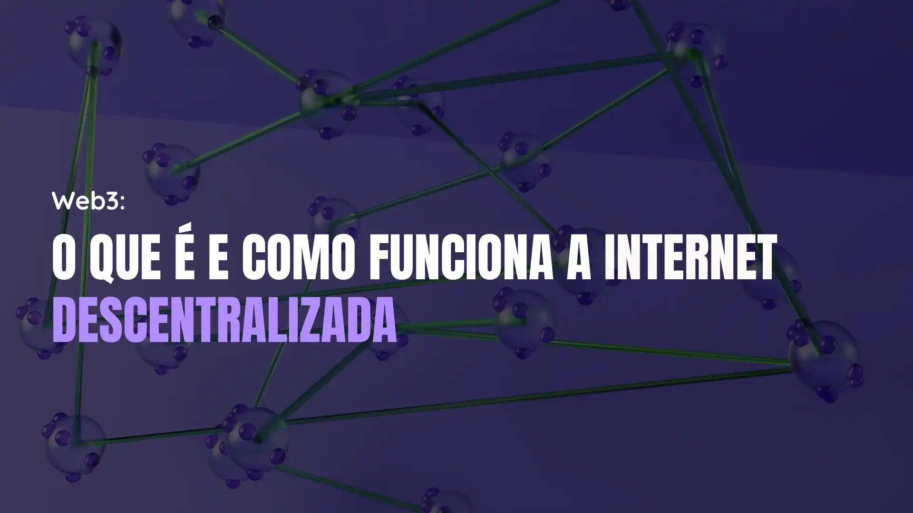

# Web3: O Que É e Como Funciona a Internet Descentralizada

## Informações

- **Tags:** Web3
- **Data de Publicação:** 31/07/2024 

## Artigo

Você já ouviu falar em Web3? Se ainda não, prepare-se para descobrir uma nova era da internet que vem crescendo a cada dia. Na internet que conhecemos hoje, grandes corporações acabam se tornando proprietárias dos nossos dados. É como se você construísse uma casa em um terreno alugado – a qualquer momento, o verdadeiro dono pode aparecer e tomar o terreno de volta. Agora imagine uma internet onde você realmente possui o terreno em que construiu sua casa. Bem-vindo ao mundo da Web3!

### O que é Web3

A Web3 é a próxima evolução da internet, prometendo ser mais aberta, transparente e descentralizada. Ao contrário da internet atual, controlada por grandes empresas, a Web3 funciona através de blockchains, criando uma rede governada pelo coletivo. É um novo paradigma onde a internet é gerida por seus próprios usuários, e não por interesses corporativos.

### Evolução da Web

#### Web 1.0 - Leitura

A primeira fase da internet, conhecida como Web 1.0, era como ler um livro. Era estática e sem interação. Você acessava portais empresariais, blogs e notícias, mas não podia interagir muito. Era como passear por uma biblioteca cheia de livros, mas sem poder conversar com outros leitores.

#### Web 2.0 - Leitura e escrita

A Web 2.0 trouxe a dinamicidade. Agora, além de ler, você podia escrever e interagir. Redes sociais e plataformas como Facebook e YouTube surgiram, permitindo que todos pudessem criar conteúdo. No entanto, todo esse conteúdo estava em "terreno alugado" – pertencendo às plataformas, não a você.

#### Web 3.0 - Leitura, escrita e propriedade

Bem-vindo à Web 3.0! Nesta nova era, você não só lê e escreve, mas também tem a propriedade sobre suas informações. Com o uso de tokens e blockchain, a Web3 elimina intermediários e garante que suas informações sejam suas de verdade, sem a possibilidade de alterações por grandes corporações.

### Economia de Propriedade

Na Web3, a propriedade é real. Isso significa que os ativos digitais são seus, não de terceiros, permitindo um autogerenciamento total. A blockchain traz uma confiança baseada no código, sem a necessidade de confiar em pessoas ou intermediários. Isso proporciona imutabilidade e evita censura. Se você já ouviu que "se o serviço é de graça, você é o produto", a Web3 vem para mudar isso, garantindo a propriedade do valor.

### Por Que a Web3 Importa

A Web3 é fundamental por várias razões:

- **Construção de uma Internet de Propriedade:** Sem intermediários, você tem o controle total.

- **Democratização do Acesso:** Poder e controle distribuídos entre todos os usuários.

- **Resistência à Censura:** Seus dados permanecem íntegros e livres de manipulação.

- **Nova Economia:** Uma economia digital onde você realmente possui e controla seus ativos.

A Web3 promete transformar a forma como interagimos com a internet, tornando-a mais justa, segura e verdadeiramente nossa. Está pronto para embarcar nessa nova era digital?