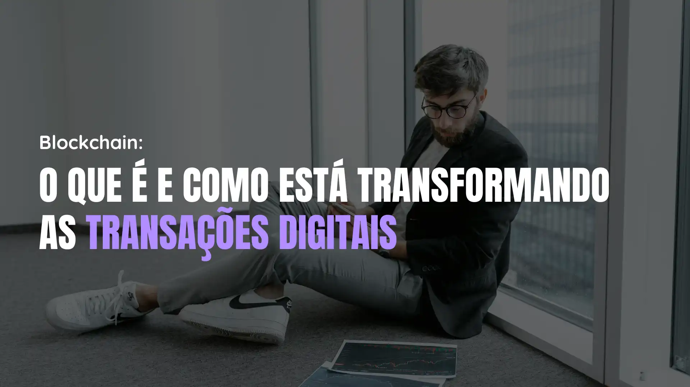

# Blockchain: O Que É e Como Está Transformando as Transações Digitais

## Informações

- **Tags:** Blockchain
- **Data de Publicação:** 08/08/2024 

## Artigo

Imagine que você tem um caderno onde anota tudo o que gasta no mês. Agora, pense em um caderno igualzinho, mas compartilhado com várias pessoas ao redor do mundo. Cada vez que alguém anota algo, todos os outros cadernos se atualizam automaticamente, e ninguém pode apagar ou alterar o que foi escrito. Parece mágico, não é? Esse é o conceito básico por trás do blockchain! E não se preocupe, vou te explicar como isso funciona de uma forma que qualquer um pode entender, mesmo sem ser um expert em tecnologia.

### O Que é Blockchain? (E por Que Deveria Importar?)

Blockchain é uma tecnologia que basicamente permite que pessoas e empresas façam transações entre si sem precisar de um "intermediário" de confiança, como um banco. Você deve estar se perguntando: "Mas como isso é possível?" A resposta é simples: usando criptografia. Cada transação é registrada em um "bloco" e esse bloco é adicionado a uma "cadeia" de blocos anteriores (daí o nome blockchain).

Vamos fazer uma analogia: pense na blockchain como uma fila de pessoas esperando para pagar por um produto em uma loja. Cada pessoa na fila representa uma transação, e a fila inteira representa o blockchain. Se alguém tentasse furar a fila (ou seja, alterar uma transação), todos notariam, porque cada pessoa (ou bloco) tem informações sobre quem está à sua frente e atrás.

### Como Tudo Começou: Bitcoin

Tudo começou com o Bitcoin, criado por uma pessoa (ou grupo) anônima chamada Satoshi Nakamoto. A ideia era simples, mas revolucionária: criar uma forma de dinheiro digital que pudesse ser transferida diretamente entre pessoas, sem a necessidade de um banco ou outra instituição financeira.

Satoshi Nakamoto descreveu o Bitcoin como "uma versão peer-to-peer de dinheiro eletrônico", o que significa que você pode enviar dinheiro diretamente para outra pessoa, sem intermediários. Um dos maiores problemas que o Bitcoin resolveu foi o gasto duplo, que é a possibilidade de gastar o mesmo dinheiro duas vezes. Graças à criptografia e ao blockchain, isso não é mais uma preocupação.

### Os "Nodes" do Blockchain: Como Funciona?

Para garantir que tudo funcione corretamente, a rede blockchain é composta por diferentes "nodes", que são basicamente computadores conectados à rede. Esses nodes desempenham funções diferentes:

- **Full-Nodes:** Imagine que eles são como bibliotecários que guardam cópias completas de todos os livros da biblioteca. Eles armazenam todo o histórico de transações e ajudam a retransmitir novas informações para outros nodes.

- **Mining-Nodes:** Pense neles como caçadores de tesouros que resolvem quebra-cabeças complexos. Quando eles encontram a solução, recebem uma recompensa em Bitcoin. Esses "caçadores" agrupam as transações em blocos e os adicionam ao blockchain.

- **Light-Nodes:** Esses são como estagiários que ajudam os bibliotecários a manterem o histórico atualizado, mas sem precisar guardar todos os livros.

- **Super-Nodes:** Eles são como bibliotecários experientes, com mais poder e responsabilidade, capazes de verificar e aprovar transações com rapidez.

### Ethereum: A Evolução do Blockchain

Se o Bitcoin foi o pioneiro no uso da blockchain para dinheiro digital, o Ethereum levou as coisas a um novo nível. Criado por Vitalik Buterin, o Ethereum não é apenas sobre enviar dinheiro; ele também permite a criação de programas chamados "smart contracts" (ou contratos inteligentes).

#### O Que é um Smart Contract?

Pense em um smart contract como uma máquina de vendas automática. Quando você insere o dinheiro, a máquina verifica o valor e, se tudo estiver certo, entrega o produto. Um smart contract funciona da mesma forma, só que digitalmente. Esses contratos são armazenados na blockchain e executam automaticamente os termos que foram programados, sem precisar de intermediários.

Por exemplo, imagine que você quer vender sua bicicleta. Em vez de confiar em um site para mediar a venda, você pode usar um smart contract. Assim que o comprador envia o pagamento, o contrato automaticamente transfere a propriedade da bicicleta para ele.

#### Por Que Isso é Importante?

Os smart contracts são usados para muito mais do que apenas vendas. Eles podem ser aplicados em jogos, finanças, rastreamento de produtos, NFTs (tokens não-fungíveis) e uma série de outras coisas. E o melhor de tudo: uma vez que o contrato é colocado em produção, ele não pode ser alterado, garantindo total transparência e segurança.

### Blockchain Trilema: Escolhendo Prioridades

Agora, vamos falar sobre um desafio interessante que os desenvolvedores enfrentam ao trabalhar com blockchains, chamado de "trilema". Esse termo é usado para descrever o fato de que é difícil para uma blockchain ser escalável, segura e descentralizada ao mesmo tempo. Em outras palavras, normalmente, uma blockchain precisa priorizar dois desses aspectos e comprometer o terceiro.

Por exemplo, o Bitcoin e o Ethereum são extremamente seguros e descentralizados, mas não são os sistemas mais rápidos ou escaláveis.

### Criptomoedas: Bitcoin, Ether e Muito Mais

Criptomoedas são como moedas digitais que utilizam criptografia para garantir transações seguras. O Bitcoin foi a primeira, mas existem muitas outras, conhecidas como altcoins, como Litecoin, Solana e Cardano. Algumas delas são variações do Bitcoin, enquanto outras, como o Ethereum, foram criadas do zero.

#### Criptomoedas e Tokens

Além das criptomoedas, existem também os tokens, que são criados dentro de uma blockchain existente. Um exemplo de token é o USDT

(Tether), que é atrelado ao valor do dólar americano, oferecendo uma forma estável de negociar dentro do mundo das criptomoedas.

#### É Seguro Investir em Criptomoedas?

Assim como qualquer investimento, o mercado de criptomoedas tem seus riscos. Algumas criptomoedas podem ser voláteis, com preços que sobem e descem rapidamente. Além disso, sempre há o perigo de golpes, como esquemas de pirâmide, ou ataques de hackers. Por isso, é importante fazer sua pesquisa e, se possível, começar com pequenas quantias.

Para negociar criptomoedas, você pode usar exchanges (corretoras online) ou fazer transações diretas com outras pessoas (P2P). Mas lembre-se, sempre com cautela!

### O Futuro do Blockchain: Inovações e Aplicações

O blockchain não é apenas sobre criptomoedas; suas aplicações são vastas e em constante crescimento. Para superar o trilema que mencionamos, novas soluções estão surgindo, como as camadas adicionais (Layers) e os "rollups". Essas tecnologias ajudam a processar transações de forma mais rápida e eficiente, o que é essencial para o crescimento e adoção do blockchain em larga escala.

#### Exemplos de Aplicações no Dia a Dia

- **Rastreamento de Produtos:** Blockchain pode ser usado para rastrear a origem de produtos, como alimentos, garantindo que você saiba exatamente de onde veio o que está consumindo.

- **Identidade Digital:** Pode ajudar a criar identidades digitais seguras e imutáveis, protegendo informações pessoais e eliminando a necessidade de vários logins e senhas.

- **Jogos Online:** Muitos jogos agora utilizam blockchain para garantir que itens virtuais, como skins e armas, sejam realmente de propriedade do jogador e possam ser trocados de forma segura.
