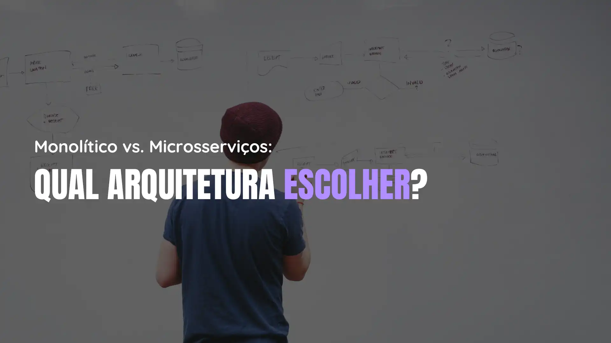

<h1 align="center">OBlog</h1>

Este repositório contém artigos técnicos práticos e descomplicados sobre tecnologia.

<table align="center">
  <thead>
    <tr>
      <th>Título</th>
      <th>Data</th>
      <th>Thumbnail</th>
    </tr>
  </thead>
  <tbody>
    <tr>
      <td>
        <a href="./9/">Dominando o Node.js: Guia Prático das APIs Nativas Mais Importantes</a>
      </td>
      <td>
        21/02/2025
      </td>
      <td>
        
      </td>
    </tr>
    <tr>
      <td>
        <a href="./8/">DeepSeek R1: Como o modelo de IA open source da China está revolucionando o mercado e ajudando desenvolvedores</a>
      </td>
      <td>
        28/01/2025
      </td>
      <td>
        
      </td>
    </tr>
    <tr>
      <td>
        <a href="./7/">Compatibilidade de Código: O Papel do Versionamento Semântico</a>
      </td>
      <td>
        28/11/2024
      </td>
      <td>
        
      </td>
    </tr>
    <tr>
      <td>
        <a href="./6/">Anti-padrões e Padrões Arquiteturais: Construindo Software da Forma Certa</a>
      </td>
      <td>
        14/10/2024
      </td>
      <td>
        
      </td>
    </tr>
    <tr>
      <td>
        <a href="./5/">Monolítico vs. Microsserviços: Qual Arquitetura Escolher?</a>
      </td>
      <td>
        14/09/2024
      </td>
      <td>
        
      </td>
    </tr>
    <tr>
      <td>
        <a href="./4/">Gerenciadores de Pacotes JavaScript: Como Escolher o Melhor para Seus Projetos</a>
      </td>
      <td>
        21/08/2024
      </td>
      <td>
        
      </td>
    </tr>
    <tr>
      <td>
        <a href="./3/">Blockchain: O Que É e Como Está Transformando as Transações Digitais</a>
      </td>
      <td>
        08/08/2024
      </td>
      <td>
        
      </td>
    </tr>
    <tr>
      <td>
        <a href="./2/">Web3: O Que É e Como Funciona a Internet Descentralizada</a>
      </td>
      <td>
        31/07/2024
      </td>
      <td>
        
      </td>
    </tr>
    <tr>
      <td>
        <a href="./1/">Amazon Bedrock: Transformando Sonhos em Realidade na Era da Inteligência Artificial</a>
      </td>
      <td>
        11/06/2024
      </td>
      <td>
        
      </td>
    </tr>
  </tbody>
</table>
